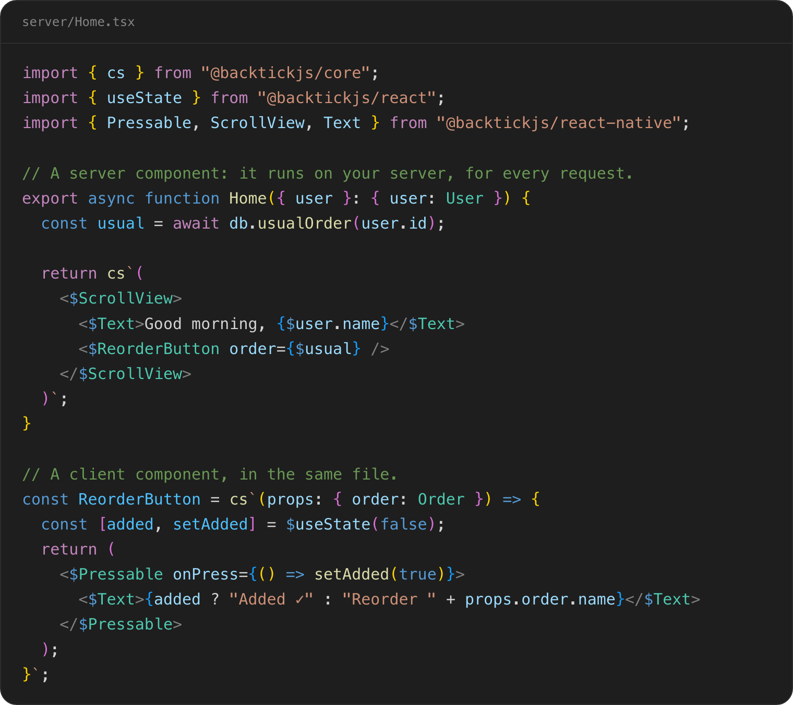

<a href="https://backtickjs.com/">
  <picture>
    <source media="(prefers-color-scheme: dark)" srcset="assets/banner-dark.png" />
    
  </picture>
</a>

<br />

[](https://www.npmjs.com/package/create-backtick-app)
[](LICENSE)
[](https://marketplace.visualstudio.com/items?itemName=backtickjs.backtick-vscode)

## What is Backtick?

A delightful programming model for React Native. Write screens on your
server, type-checked end to end, and ship them without an app release.

[Website](https://backtickjs.com) · [Docs](https://backtickjs.com/docs) ·
[VS Code extension](https://marketplace.visualstudio.com/items?itemName=backtickjs.backtick-vscode) ·
[Discussions](https://github.com/backtickjs/backtick/discussions) ·
[X](https://x.com/backtickjs) ·
[Bluesky](https://bsky.app/profile/backtickjs.com)

## Quick start

```sh
npx create-backtick-app@latest
```

It asks for a name, a framework (React Native, React or Solid) and a runtime
(Node or Bun), then creates a project with a Backtick server beside it. For
React Native, that's an Expo app: run `npm start`, scan the QR code with your
phone, and edit `server/Home.tsx` to change the screen.

## What it looks like

A screen can be made of server components, client components or both, like
this one. The server component reads its data where it lives, and the client
code sits inline, in a client script, `` cs`…` ``. Each splice, `$name`, is
a value crossing from your server to the client, type-checked on both sides.
[Thinking in Backtick](https://backtickjs.com/docs/thinking-in-backtick)
explains what runs where.



<details>
<summary>The code, to copy</summary>

```tsx
import { cs } from "@backtickjs/core";
import { useState } from "@backtickjs/react";
import { Pressable, ScrollView, Text } from "@backtickjs/react-native";

// A server component: it runs on your server, for every request.
export async function Home({ user }: { user: User }) {
  const usual = await db.usualOrder(user.id);

  return cs`(
    <$ScrollView>
      <$Text>Good morning, {$user.name}</$Text>
      {$usual && <$ReorderButton order={$usual} />}
    </$ScrollView>
  )`;
}

// A client component, in the same file.
const ReorderButton = cs`(props: { order: Order }) => {
  const [added, setAdded] = $useState(false);
  return (
    <$Pressable onPress={() => setAdded(true)}>
      <$Text>{added ? "Added ✓" : "Reorder " + props.order.name}</$Text>
    </$Pressable>
  );
}`;
```

</details>

## How it works

- **Compiled once.** Client scripts are compiled at build time, and
  type-checked and formatted like the rest of your code.
- **Bundled per request.** On each request, the bundler runs your server
  components and combines their data with the compiled scripts into one
  JavaScript file. Only the scripts a request rendered are in it, and data is
  written as data, never as code.
- **Run by the client.** On the web, a page loads the bundle with a script tag
  and an import map. On React Native, your app fetches it and runs it with the
  React Native it already ships, so a server deploy is the release: users get
  your changes the next time they open the screen.

## Packages

| Package                                                           | What it is                                                         |
| ----------------------------------------------------------------- | ------------------------------------------------------------------ |
| [`create-backtick-app`](packages/create-backtick-app)             | Creates a project: React Native, React or Solid, on Node or Bun    |
| [`@backtickjs/core`](packages/core)                               | The `cs` tag, and the types for what crosses to the client         |
| [`@backtickjs/bundler`](packages/bundler)                         | Runs server components and bundles a screen per request            |
| [`@backtickjs/react-native`](packages/react-native)               | React Native's components and APIs, for scripts                    |
| [`@backtickjs/react`](packages/react)                             | React's hooks and APIs, for scripts                                |
| [`@backtickjs/solid-js`](packages/solid-js)                       | Solid's primitives, for scripts                                    |
| [`@backtickjs/react-native-client`](packages/react-native-client) | `evaluate`: runs a bundle with your app's own packages             |
| [`@backtickjs/node-plugin`](packages/node-plugin)                 | Compiles scripts as a Node server loads them                       |
| [`@backtickjs/bun-plugin`](packages/bun-plugin)                   | Compiles scripts as a Bun server loads them                        |
| [`@backtickjs/tspatch-plugin`](packages/tspatch-plugin)           | Compiles scripts when you build a server ahead of time with `tspc` |
| [`@backtickjs/tsc`](packages/tsc)                                 | `backtick-tsc`: type-checks scripts and their splices              |
| [`@backtickjs/prettier-plugin`](packages/prettier-plugin)         | Formats the code inside scripts                                    |

Internal packages, used by the ones above: [`compiler`](packages/compiler),
[`language-plugin`](packages/language-plugin),
[`language-service`](packages/language-service),
[`language-server`](packages/language-server) and
[`typescript-plugin`](packages/typescript-plugin).

## Editor support

- **[Backtick for VS Code](https://marketplace.visualstudio.com/items?itemName=backtickjs.backtick-vscode)**
  highlights scripts as TSX, colours splices, and type-checks inside scripts.
- **`backtick-tsc`** type-checks from the command line, and in CI.
- **The Prettier plugin** formats scripts on save.

## Requirements

Backtick is early. Today it supports Expo SDK 57 (React Native 0.86 and
React 19.2) and Solid 1.9, with servers on Node 22 (22.15 or later) or 24 (24.3 or later), or Bun.

## Who's behind it

I'm Jean-François Bisson. I spent a few years building mobile infrastructure
at Meta before leaving to work on Backtick full time.

I love building things and moving fast, and Backtick is my attempt to make that
easier for others too. If you're trying Backtick, thinking about server-driven
UI, or just want to chat, I'd love to hear from you. Email me at
[jf@backtickjs.com](mailto:jf@backtickjs.com), or find me on
[LinkedIn](https://www.linkedin.com/in/jfbisson/).

## License

[MIT](LICENSE)
